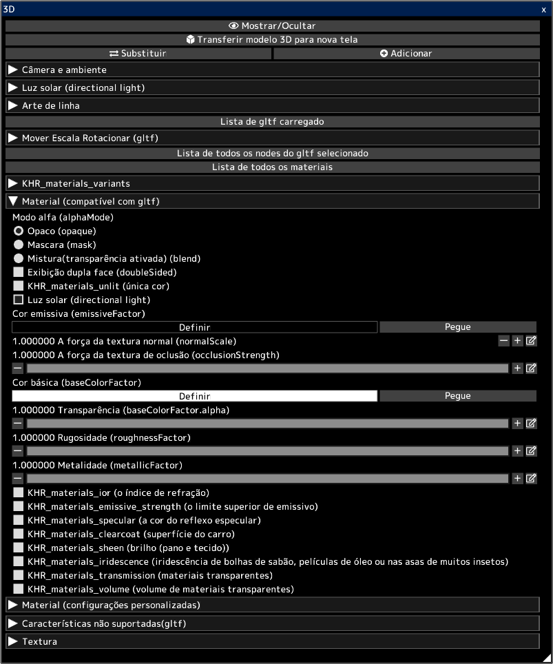

---
hide:
  - toc
---

<!-- https://steamcommunity.com/sharedfiles/filedetails/?id=2964323105 -->

Você pode abrir modelos 3D em arquivos gltf e glb.  
Você pode transferir a aparência de 3D para a tela 2D como ela é.  
Você também pode transferir a arte de linha de 3D para a tela 2D.  
Você pode usar a tela transferida para criar sua ilustração. Por exemplo, use-o como plano de fundo para uma ilustração.

Os modelos 3D podem ser criados em software 3D, como [blender](https://www.blender.org/) ou Autodesk Maya.  
Você também pode baixar modelos 3D de sites como [sketchfab](https://sketchfab.com/).

Clicar no botão __"Substituir"__ removerá todos os modelos 3D carregados anteriormente e deixará apenas o modelo 3D recém-carregado.  
Você pode adicionar um modelo 3D clicando no botão __"Adicionar"__.

Você pode selecionar um gltf de vários gltfs carregados clicando em __"Lista de gltf carregado"__.  
Você pode mover/rotacionar/escala o gltf selecionado.

Você pode selecionar o nó (objeto) no gltf selecionado clicando em __"Lista de todos os nodes do gltf selecionado"__.  
Você pode mover/rotacionar/escala o nó selecionado.

Você pode selecionar o material no gltf selecionado clicando em __"Lista de todos os materiais"__.  
Você pode ajustar os parâmetros do material selecionado.

A seção __"Material (compatível com gltf)"__ lista os parâmetros de materiais de acordo com a especificação gltf.  
Os modelos 3D criados com software 3D, como o Blender, são refletidos nos parâmetros deste item "Material (compatível com gltf)".  
[Verifique este site para salvar gltf no liquidificador.](https://docs.blender.org/manual/en/latest/addons/import_export/scene_gltf2.html#gltf-2-0)

Os modelos 3D baixados de sites como o [sketchfab](https://sketchfab.com/) podem parecer diferentes no sketchfab e no icpaint.  
Nesse caso, habilitar KHR_materials_unlit (única cor) pode dar a mesma aparência.

* "Luz solar (directional light)" está habilitada para todos os materiais ao carregar arquivos gltf ou glb. Você pode desmarcar a caixa de seleção "Luz solar (directional light)" após a importação.
* Point lights e spot lights não são suportadas (point light, spot light) (KHR_lights_punctual)
* A animação de modelos 3D não é suportada.
* Iluminação por cor emissiva (emissiveFactor) etc. não é suportada.
* Ele não suporta projeção de sombras para modelos 3D.
* KHR_draco_mesh_compression, EXT_meshopt_compression, KHR_mesh_quantization não são suportados.
* ktx2 (formato de imagem) não é suportado (KHR_texture_basisu)

[Verifique este site para saber como editar gltf com um editor de texto.](https://github.com/KhronosGroup/glTF-Tutorials/blob/master/AddingMaterialExtensions/AddingMaterialExtensions_002_UsingVisualStudioCode.md#using-visual-studio-code)

As descrições oficiais dos parâmetros na seção __"Material (compatível com gltf)"__ são:

* [a especificação de gltf](https://registry.khronos.org/glTF/specs/2.0/glTF-2.0.html)
* [descrição do modo alfa (alphaMode)](https://registry.khronos.org/glTF/specs/2.0/glTF-2.0.html#alpha-coverage)
* [descrição do dupla face (doubleSided)](https://registry.khronos.org/glTF/specs/2.0/glTF-2.0.html#double-sided)
* [KHR_materials_unlit (única cor)](https://github.com/KhronosGroup/glTF/tree/main/extensions/2.0/Khronos/KHR_materials_unlit#khr_materials_unlit)
* [descrição básica do material](https://github.com/KhronosGroup/glTF-Tutorials/blob/master/gltfTutorial/gltfTutorial_010_Materials.md#materials)
* [KHR_materials_ior (o índice de refração)](https://github.com/KhronosGroup/glTF/tree/main/extensions/2.0/Khronos/KHR_materials_ior#khr_materials_ior)
* [KHR_materials_emissive_strength (o limite superior de emissivo)](https://github.com/KhronosGroup/glTF/tree/main/extensions/2.0/Khronos/KHR_materials_emissive_strength#khr_materials_emissive_strength)
* [KHR_materials_specular (a cor do reflexo especular)](https://github.com/KhronosGroup/glTF/tree/main/extensions/2.0/Khronos/KHR_materials_specular#khr_materials_specular)
* [KHR_materials_clearcoat (superfície do carro)](https://github.com/KhronosGroup/glTF/tree/main/extensions/2.0/Khronos/KHR_materials_clearcoat#khr_materials_clearcoat)
* [KHR_materials_sheen (brilho (pano e tecido))](https://github.com/KhronosGroup/glTF/tree/main/extensions/2.0/Khronos/KHR_materials_sheen#khr_materials_sheen)
* [KHR_materials_iridescence (iridescência de bolhas de sabão, películas de óleo ou nas asas de muitos insetos)](https://github.com/KhronosGroup/glTF/tree/main/extensions/2.0/Khronos/KHR_materials_iridescence#khr_materials_iridescence)
* [KHR_materials_transmission (materiais transparentes)](https://github.com/KhronosGroup/glTF/tree/main/extensions/2.0/Khronos/KHR_materials_transmission#khr_materials_transmission-)
* [KHR_materials_volume (volume de materiais transparentes)](https://github.com/KhronosGroup/glTF/tree/main/extensions/2.0/Khronos/KHR_materials_volume#khr_materials_volume)
