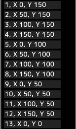

---
hide:
  - toc
---

<!-- https://steamcommunity.com/sharedfiles/filedetails/?id=2963164262 -->

A animação expressa o movimento alternando continuamente as imagens para cada fotograma.

Cada fotograma é uma área(retângulo) na tela.  
Todos os fotogramas são exibidos na tela.

Quando você abre um arquivo gif ou webp animado, a tela é criada com a animação pronta para ser reproduzida.  
No entanto, se o tamanho da tela for muito grande, a animação não será criada.

Por exemplo, nesta tela, cada fotograma da animação é uma área quadrada com números de 1 a 13.  
Quando você reproduzir a animação, ela será reproduzida da seguinte maneira.

### Como criar animação

Primeiro, crie uma tela semelhante a esta.  
Em seguida, abra a janela "Animação" clicando no botão "Janela de animação" no menu "Tela".

Você cria 13 fotogramas.

Você pode especificar a posição inferior esquerda de cada fotograma.  
__"1, X 0, Y 150"__ significa que a posição inferior esquerda do primeiro fotograma é (0, 150).  
A posição inferior esquerda da tela é (0, 0).  
Neste exemplo, cada fotograma tem largura e altura de 50 px.  
Quando um fotograma é selecionado, um quadro retangular azul é exibido na tela.

Se a caixa de seleção __"Escolha a cor da imagem integrada"__ estiver marcada, a animação será reproduzida com a aparência atual da tela.  
Se esta caixa de seleção estiver desativada, a animação será reproduzida apenas com a aparência da camada especificada.

A animação será reproduzida clicando no botão __"Iniciar"__.  
Você pode alterar a posição e o tamanho da animação reproduzida selecionando a ferramenta de animação.

Você pode salvar a animação como um arquivo gif ou webp.  
Como os arquivos gif têm um número limitado de cores, você pode salvar como um arquivo gif somente quando a camada de pixel art estiver selecionada.  
Nesse caso, você precisa desenhar a animação na camada de pixel art.
