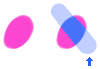

---
hide:
  - toc
---

<!-- https://steamcommunity.com/sharedfiles/filedetails/?id=2966161810 -->

Aerógrafo

・ Mais suave  
・ Espaçamento 0.5  
・ Tamanho 50  
・ Opacidade 20%  
・ Tamanho mínimo 100  
・ Opacidade mínima 30%

---

・ Suave  
・ __Espaçamento 0.1__  
・ Tamanho 8  
・ Opacidade 50%  
・ Tamanho mínimo 0  
・ Opacidade mínima 0%

---

・ Duro  
・ __Espaçamento 2.0__  
・ Tamanho 14  
・ Opacidade 100%  
・ Tamanho mínimo 0  
・ Opacidade mínima 100%

---

・ __Imagem de círculo de pincel (star.tga)__  
・ Espaçamento 2.0  
・ Tamanho 14  
・ Opacidade 100%  
・ Tamanho mínimo 0  
・ Opacidade mínima 100%

---

・ Duro  
・ Espaçamento 2.0  
・ Tamanho 14  
・ Opacidade 100%  
・ Tamanho mínimo 0  
・ Opacidade mínima 100%  
・ __Textura da base do pincel (tex.tga)__

---

・ __Imagem de círculo de pincel (star.tga)__  
・ Espaçamento 2.0  
・ Tamanho 18  
・ Opacidade 100%  
・ Tamanho mínimo 0  
・ Opacidade mínima 100%  
・ __Textura da base do pincel (tex.tga)__

---

・ __Imagem de círculo de pincel (img.tga)__  
・ Espaçamento 1.0  
・ Tamanho 35  
・ Opacidade 100%  
・ Tamanho mínimo 40  
・ Opacidade mínima 40%  
・ Ângulo aleatório 179°

---

・ Mais suave  
・ Espaçamento 0.3  
・ Tamanho 20  
・ Opacidade 60%  
・ Tamanho mínimo 70  
・ Opacidade mínima 20%  
・ __Textura da base do pincel (tex.tga)__

---

・ Mais suave  
・ Espaçamento 0.3  
・ Tamanho 20  
・ Opacidade 60%  
・ Tamanho mínimo 70  
・ Opacidade mínima 20%  
・ __Textura da base do pincel (circle.png)__  
・ Escala 30% (Textura da base do pincel)

circle.png

---

・ Duro  
・ Espaçamento 2.0  
・ Tamanho 18  
・ Opacidade 100%  
・ Tamanho mínimo 0  
・ Opacidade mínima 100%  
・ __Elipse 40%__  
・ Ângulo 0°

---

・ Duro  
・ Espaçamento 2.0  
・ Tamanho 18  
・ Opacidade 100%  
・ Tamanho mínimo 0  
・ Opacidade mínima 100%  
・ __Elipse 40%__  
・ __Ângulo 130°__

---

Se o botão superior da janela de ferramentas for "__Marcador__", ele será pintado de forma que as cores sejam substituídas.

---

Se o botão superior da janela de ferramentas for "__Borrão(Cor média)__", ele será pintado com a cor média do desenho dentro do círculo do pincel.  
Se a caixa de seleção "__Escolha a cor da imagem integrada__" estiver marcada, a cor média é determinada com base na aparência atual da tela.  
Se esta caixa de seleção estiver desmarcada, a cor média é determinada com base no que é desenhado na camada atual.

---

Se o botão superior da janela de ferramentas for "__Mistura__"

① Cor mista 70,  Cor estendida 70, Quantidade de água 10  
② Cor mista 90,  Cor estendida 70, Quantidade de água 10  
③ Cor mista 90,  Cor estendida 0, Quantidade de água 10 (pintar com uma linha)  
④ Cor mista 90,  Cor estendida 70, Quantidade de água 10 (pintar com uma linha)  
⑤ Cor mista 90,  Cor estendida 0, Quantidade de água 0  
⑥ Cor mista 90,  Cor estendida 0, Quantidade de água 70

・ Suave  
・ Espaçamento 0.1  
・ Tamanho 16  
・ Opacidade 20%  
・ Tamanho mínimo 50  
・ Opacidade mínima 0%
