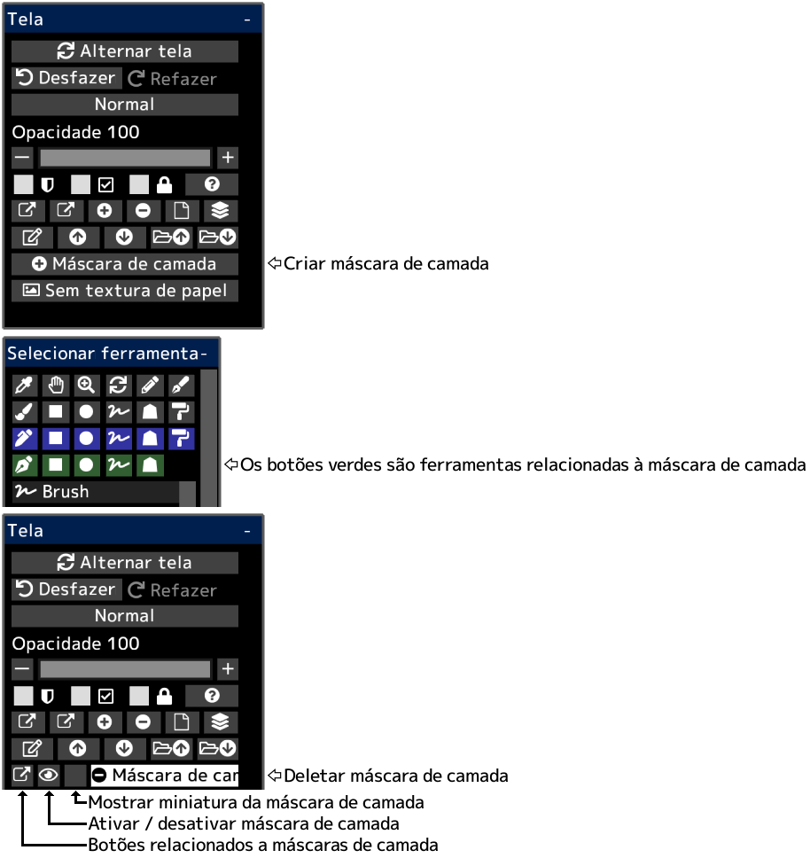

---
hide:
  - toc
---

<!-- https://steamcommunity.com/sharedfiles/filedetails/?id=2953903874 -->

Você pode ocultar parcialmente o conteúdo do desenho usando uma máscara de camada.  
Uma máscara de camada tem uma opacidade (0 ~ 255).  
Você também pode criar uma máscara de camada para o grupo.  
Se você criar uma máscara de camada para a camada de ajuste, poderá ajustar a parte a ser afetada pela camada de ajuste.
