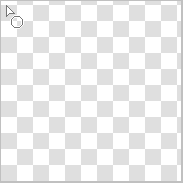

---
hide:
  - toc
---

<!-- https://steamcommunity.com/sharedfiles/filedetails/?id=2967683033 -->

Você pode selecionar a ferramenta "Retângulo" clicando no botão ■ na janela "Selecionar ferramenta".

Exemplo de pintura com RGBA (44,134,245,150)

Exemplo de pintura com __"Cantos arredondados"__ marcado e definido como 60 %

Exemplo de pintura com a caixa de seleção __"Moldura"__ ativada

Se você marcar a caixa de seleção __"Rácio de aspecto"__, poderá corrigir a proporção entre a altura e a largura do retângulo.  
Se você marcar a caixa de seleção __"px"__, poderá especificar a altura e a largura do retângulo em unidades de px.

### Ferramenta "Círculo"

Exemplo de pintura com RGBA (44,134,245,150)

Exemplo de pintura com o botão de opção "Mais suave" selecionado

Exemplo de pintura com __"Elipse"__ marcada e definida como 40

Exemplo de pintura com o botão de opção "Mais suave" selecionado

### Ferramenta "Lasso"

Exemplo de pintura sem borrão (RGBA (44,134,245,255))

Exemplo de pintura com borrão 15x15 px (RGBA (44,134,245,150))

Exemplo de pintura com a caixa de seleção __"Modo de visualização"__ ativada (borrão 3x3 px)

### Ferramenta "Polígono"

Com a ferramenta "Polígono", a posição clicada torna-se o vértice do polígono.  
Você pode desfazer até um.

---

Todos esses métodos de pintura também podem ser pintados no __"Modo de mesclagem"__.  
Por exemplo, você pode torná-lo mais escuro pintando com o modo de mesclagem "Multiplicação".  
Além disso, por exemplo, você pode torná-lo mais brilhante pintando-o com um amarelo esbranquiçado no modo de mesclagem "Adicionar(Brilho)".
