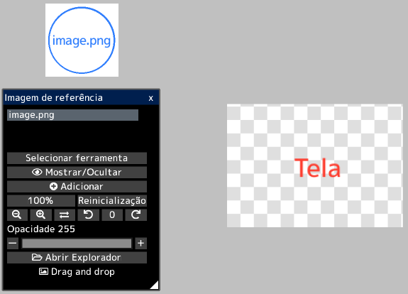
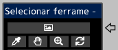

---
hide:
  - toc
---

<!-- https://steamcommunity.com/sharedfiles/filedetails/?id=2966627009 -->

Ao abrir a imagem na janela "Imagem de referência", você pode exibir a imagem separadamente da tela.  
Você pode usá-lo como referência ao criar ilustrações.

Você pode mover livremente a imagem de referência clicando no botão __"Selecionar ferramenta"__.  
Você também pode selecionar ferramentas para imagens de referência na janela "Selecionar ferramenta".

