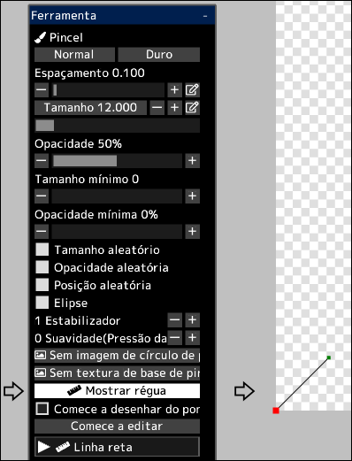

---
hide:
  - toc
---

<!-- https://steamcommunity.com/sharedfiles/filedetails/?id=2969759692 -->

Você pode desenhar pinceladas ao longo da régua.

Ao clicar no botão __"Mostrar régua"__, a régua será exibida na posição inferior esquerda da tela.  
Esta régua tem o mesmo recurso que as curvas em camadas vetoriais.  
O ponto vermelho na régua é o ponto inicial da régua.

Quando a opção __"Comece a desenhar do ponto inicial da régua(ponto vermelho)"__ estiver desmarcada, a pincelada será a partir do ponto de menor distância entre a posição tocada com o pincel e a régua.

Ao clicar no botão __"Comece a editar"__, você poderá alterar a forma da régua.

|  | Como utilizar |
| ------ | ----------- |
| Selecione o ponto de controle  | Clique no ponto de controle |
| Mova o ponto de controle       | Clique e arraste o ponto de controle |
| Excluir o ponto de controle    | Alt + clique no ponto de controle |
| Se o ponto de controle deve ser nítido ou uma curva suave | Ctrl + clique no ponto de controle |
| Adicione um ponto de controle ao final da curva | Clique em qualquer lugar que não seja o ponto de controle |
| Adicione um ponto de controle no meio da curva  | Clique em qualquer lugar na curva |
| Adicione um ponto de controle (ângulo agudo) ao final da curva | Ctrl + clique em qualquer lugar que não seja o ponto de controle |
| Adicione um ponto de controle (ângulo agudo) no meio da curva | Ctrl + clique em qualquer lugar na curva |
| Mova a curva enquanto mantém a forma da curva | Shift + Alt + clique e arraste |
| Mova múltiplos pontos de controle juntos | Shift + clique e arraste para mover todos os pontos de controle dentro do círculo |
| Escale a curva | Ctrl + Alt + clique e arraste para a esquerda ou para a direita |
| Gire a curva em torno da posição clicada | Ctrl + Shift + Alt + clique e arraste para a esquerda ou para a direita |

Ao clicar no botão __"Acabar a editar"__, você poderá desenhar com o pincel novamente.
