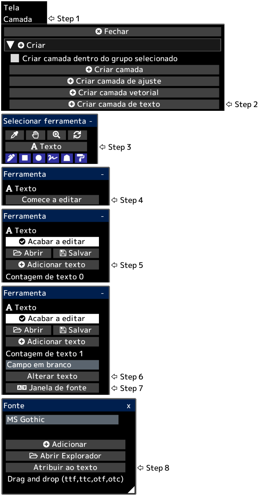

---
hide:
  - toc
---

<!-- https://steamcommunity.com/sharedfiles/filedetails/?id=2954851257 -->

O texto é criado na posição inferior esquerda da tela.  
Depois de clicar em __"Acabar a editar"__, a opacidade da camada, o modo de mesclagem, a máscara de camada etc. serão aplicados.

Você pode converter uma camada de texto em uma camada de desenho clicando no botão __"Rasterizar camada"__ no menu "Camada".
