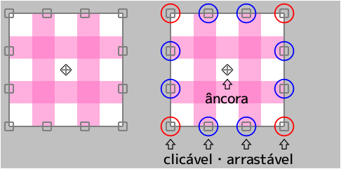
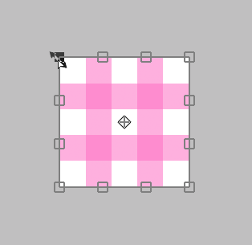
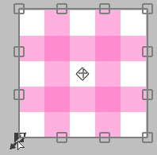

---
hide:
  - toc
---

<!-- https://steamcommunity.com/sharedfiles/filedetails/?id=2955709127 -->

### Se o cursor estiver dentro da área de transformação

Você pode movê-lo livremente clicando.

Você pode movê-lo apenas horizontalmente ou apenas verticalmente pressionando Shift + clique.

### Se o cursor estiver fora da área de transformação

Você pode girá-lo clicando.

Você pode girá-lo em torno da âncora pressionando Ctrl + clique.

### Se o cursor estiver na âncora

Você pode mover apenas a âncora clicando.

### Se o cursor estiver na borda ( □ ) superior, inferior, esquerda ou direita

Você pode mover a borda clicando.

Você pode mover os dois lados ao mesmo tempo sem mover a posição central pressionando Alt + clicando.

Você pode mover a aresta livremente pressionando Ctrl + clicando.

Você pode mover a aresta ao longo de sua direção pressionando Ctrl + Shift + clicando.

### Se o cursor estiver em 4 vértices ( □ )

Você pode mover o vértice clicando.

Você pode dimensioná-lo e girá-lo com Alt + clique.

Você pode escalá-lo uniformemente pressionando Shift + clicando.

Você pode dimensioná-lo uniformemente sem mover a posição central pressionando Shift + Alt + clicando.

---

Você pode mover apenas o vértice livremente pressionando Ctrl + clicando.  
Nesse caso, a aparência muda de três maneiras.

#### Ctrl + clicando em "Transformar"

#### Ctrl + clicando em "Transformação de perspectiva" com "Perspectiva" desligado

#### Ctrl + clicando em "Transformação de perspectiva" com "Perspectiva" ativado

Você pode retornar ao estado anterior à transformação pressionando o botão __"Reinicialização"__.

* Transformar(tamanho da tela)
* Mover Escala Rotacionar(tamanho da tela)
* Transformação de perspectiva
* Filtro dissolver
* Filtro retocar

Esses cinco métodos podem salvar o conteúdo da transformação.  
Se salvo, você pode aplicar a mesma transformação a outra camada.

Se você deseja transformar especificando um valor numérico, use __"Mover Escala Rotacionar"__.  
Por exemplo, se você quiser dimensioná-lo para 50 % ou girá-lo em 45 graus.
