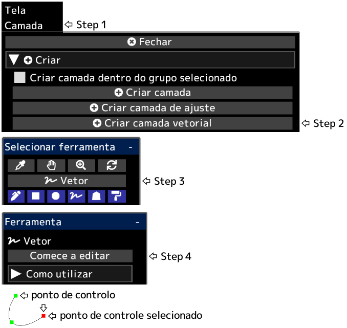

---
hide:
  - toc
---

<!-- https://steamcommunity.com/sharedfiles/filedetails/?id=2955214030 -->

Depois de clicar em __"Acabar a editar"__, a opacidade da camada, o modo de mesclagem, a máscara de camada etc. serão aplicados.

Você pode converter uma camada vetorial em uma camada de desenho clicando no botão __"Rasterizar camada"__ no menu "Camada".

|  | Como utilizar |
| ------ | ----------- |
| Selecione o ponto de controle          | Clique no ponto de controle |
| Cancele a seleção do ponto de controle | Alt + clique em qualquer lugar que não seja o ponto de controle |
| Mova o ponto de controle               | Clique e arraste o ponto de controle |
| Excluir o ponto de controle            | Alt + clique no ponto de controle |
| Se o ponto de controle deve ser nítido ou uma curva suave | Ctrl + clique no ponto de controle |
| Adicione um ponto de controle ao final da curva | Clique em qualquer lugar que não seja o ponto de controle com o ponto de controle selecionado |
| Adicione um ponto de controle no meio da curva | Clique em qualquer lugar na curva com o ponto de controle selecionado |
| Adicione um ponto de controle (ângulo agudo) ao final da curva | Ctrl + clique em qualquer lugar que não seja o ponto de controle com o ponto de controle selecionado |
| Adicione um ponto de controle (ângulo agudo) no meio da curva  | Ctrl + clique em qualquer lugar na curva com o ponto de controle selecionado |
| Crie um ponto de controle como outra curva | Clique em qualquer lugar que não seja o ponto de controle sem nenhum ponto de controle selecionado |
| Crie um ponto de controle (ângulo agudo) como outra curva | Ctrl + clique em qualquer lugar que não seja o ponto de controle sem nenhum ponto de controle selecionado |
| Deletar a curva | Repita Alt + clique em todos os pontos de controle ou clique no botão "Deletar curva" |
| Mova a curva enquanto mantém a forma da curva | Shift + Alt + clique e arraste com o ponto de controle selecionado |
| Duplique a curva | Ctrl + Shift + clique e arraste com o ponto de controle selecionado |
| Mova múltiplos pontos de controle juntos | Shift + clique e arraste para mover todos os pontos de controle dentro do círculo |
| Escale a curva | Ctrl + Alt + clique e arraste para a esquerda ou para a direita |
| Gire a curva em torno da posição clicada | Ctrl + Shift + Alt + clique e arraste para a esquerda ou para a direita |
